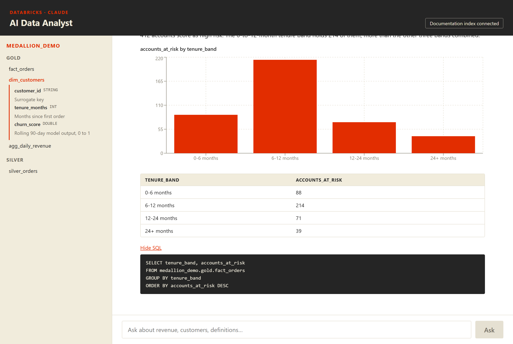

# 🤖 AI Data Analyst — Claude + Databricks Agent App

> A full-stack AI-powered data analyst application that lets users ask natural language questions about their data warehouse and get instant insights with visualizations. Built on Databricks Apps with Claude (Anthropic) as the reasoning engine.

[](https://github.com/wanwrick/ai-data-analyst/actions/workflows/tests.yml)


Running, in demo mode, with no Databricks workspace and no API key:



---

## 🎯 What This Demonstrates

- **AI Agent Architecture**: Supervisor agent routing queries to specialized sub-agents
- **Natural Language → SQL**: Claude translates business questions into optimized SQL
- **RAG Knowledge Base**: Vector search over data documentation for context-aware answers
- **Interactive Visualizations**: Auto-generated charts based on query results
- **Databricks Apps Deployment**: Production-ready full-stack app on Databricks
- **MLflow Evaluation**: Quality monitoring with custom scorers for response accuracy

---

## 📐 Architecture

```
                        AI Data Analyst App

  +--------------+       +----------------------------------------+
  |   React UI   |------>|           FastAPI Backend              |
  |              |       |                                        |
  | - Chat input |       |  +----------------------------------+  |
  | - Charts     |       |  |   Supervisor Agent (Claude)      |  |
  | - Tables     |       |  |                                  |  |
  | - History    |       |  |  Routes to:                      |  |
  +--------------+       |  |  +-- SQL Analyst Agent           |  |
                         |  |  |   (SQL Gen + Warehouse)       |  |
                         |  |  +-- Knowledge Agent             |  |
                         |  |  |   (RAG + Vector Search)       |  |
                         |  |  +-- Viz Agent                   |  |
                         |  |      (Chart recommendations)     |  |
                         |  +----------------------------------+  |
                         |                                        |
                         |  +----------------------------------+  |
                         |  |     Databricks Integration       |  |
                         |  |  - SQL Warehouse (compute)       |  |
                         |  |  - Unity Catalog (governance)    |  |
                         |  |  - Vector Search (RAG)           |  |
                         |  |  - MLflow (evaluation)           |  |
                         |  +----------------------------------+  |
                         +----------------------------------------+
```

---

## 📁 Project Structure

```
ai-data-analyst/
├── backend/
│   ├── app.py                    # FastAPI entry point
│   ├── demo.py                   # Runs everything with no credentials
│   ├── agents/
│   │   ├── base.py               # Shared client, response shape, parsing
│   │   ├── supervisor.py         # Classifies and dispatches, nothing else
│   │   ├── sql_analyst.py        # Natural language → SQL → summary
│   │   ├── knowledge_agent.py    # RAG, with a catalog-metadata fallback
│   │   └── viz_agent.py          # Chart heuristic + model suggestion
│   ├── services/
│   │   ├── databricks_client.py  # SDK wrapper
│   │   ├── vector_search.py      # Docs index, optional
│   │   └── sql_executor.py       # Validation and safe execution
│   ├── models/
│   │   └── schemas.py            # Pydantic request/response contract
│   ├── tests/                    # 76 tests, no network
│   ├── pytest.ini
│   └── requirements.txt
├── frontend/
│   ├── src/
│   │   ├── App.tsx               # Shell and health banner
│   │   ├── styles.css
│   │   ├── components/
│   │   │   ├── ChatInterface.tsx  # Turns, pending and error states
│   │   │   ├── QueryResult.tsx    # Chart, table, sources, SQL toggle
│   │   │   └── SchemaExplorer.tsx # Catalog browser
│   │   └── api/
│   │       └── client.ts         # Typed client, mirrors schemas.py
│   ├── index.html
│   ├── tsconfig.json
│   ├── package.json
│   └── vite.config.ts
├── config/
│   ├── app.yaml                  # Databricks Apps config
│   └── .env.example              # Environment variables
├── .github/workflows/tests.yml   # CI: pytest + tsc + vite build
├── docs/
│   ├── demo.png
│   └── screenshot.png
├── setup.sh                      # Dependencies, .env, connectivity check
├── watch.sh                      # Backend and frontend with reload
├── deploy.sh                     # Deploy to Databricks Apps
└── README.md
```

---

## 🚀 Quick Start

### Try it with no account

Demo mode swaps the two network calls for fixtures. Routing, the chart
heuristic, the SQL validator and the whole frontend run for real.

```bash
git clone https://github.com/wanwrick/ai-data-analyst.git
cd ai-data-analyst
pip install -r backend/requirements.txt
(cd frontend && npm install && npm run build)
(cd backend && uvicorn demo:app --port 8000)
# open http://localhost:8000
```

### Run it against your own workspace

Prerequisites: a Databricks workspace with a SQL Warehouse, an Anthropic API
key, Python 3.11+, and Node 18+.

```bash
./setup.sh      # installs deps, writes .env, checks workspace connectivity
# fill in DATABRICKS_HOST, DATABRICKS_TOKEN and ANTHROPIC_API_KEY
./watch.sh      # backend on :8000, frontend on :3000
./deploy.sh --create
```

---

## 💡 Example Queries

| User Question | Agent | Output |
|--------------|-------|--------|
| "What was our revenue last month?" | SQL Analyst | Revenue summary + trend chart |
| "Which customers are at risk of churning?" | SQL Analyst | Churn risk table + segmentation |
| "What does the RBAC transformation column mean?" | Knowledge | Documentation excerpt |
| "Show me a funnel from page views to purchases" | SQL + Viz | Funnel visualization |
| "Compare Q4 vs Q3 product performance" | SQL Analyst | Period comparison table |

---

## 🔧 Key Implementation Details

### Supervisor Agent (Claude)
The supervisor classifies incoming queries and routes to the best sub-agent:

```python
class SupervisorAgent:
    """Routes user queries to specialized sub-agents."""

    ROUTING_PROMPT = """You are a data analyst supervisor.
    Classify the user's question into one of:
    - SQL_QUERY: Questions answerable with data (metrics, trends, comparisons)
    - KNOWLEDGE: Questions about data definitions, business rules, documentation
    - VISUALIZATION: Requests to create or modify charts/dashboards
    Respond with only the classification."""

    async def route(self, question: str) -> AgentResponse:
        classification = await self.classify(question)
        if classification == "SQL_QUERY":
            return await self.sql_agent.analyze(question)
        elif classification == "KNOWLEDGE":
            return await self.knowledge_agent.search(question)
        else:
            return await self.viz_agent.recommend(question)
```

### SQL Analyst Agent
Translates natural language to SQL using Unity Catalog metadata:

```python
class SQLAnalystAgent:
    """Generates and executes SQL from natural language questions."""

    async def analyze(self, question: str) -> AnalysisResult:
        # 1. Fetch relevant table schemas from Unity Catalog
        context = await self.get_schema_context(question)

        # 2. Generate SQL with Claude
        sql = await self.generate_sql(question, context)

        # 3. Validate SQL (prevent dangerous operations)
        self.validate_sql(sql)

        # 4. Execute on SQL Warehouse
        results = await self.execute(sql)

        # 5. Generate natural language summary
        summary = await self.summarize(question, results)

        return AnalysisResult(sql=sql, data=results, summary=summary)
```

### Knowledge Agent (RAG)
Uses Databricks Vector Search for documentation Q&A:

```python
class KnowledgeAgent:
    """RAG agent over data documentation and business glossary."""

    async def search(self, question: str) -> KnowledgeResult:
        # 1. Embed question and search vector index
        docs = await self.vector_search.similarity_search(
            query=question,
            index_name="data_docs_index",
            num_results=5
        )

        # 2. Generate answer with retrieved context
        answer = await self.generate_answer(question, docs)

        return KnowledgeResult(answer=answer, sources=docs)
```

### MLflow Evaluation
Quality monitoring for every response:

```python
# Custom scorer for response accuracy
@mlflow.scorer
def sql_accuracy_scorer(inputs, outputs, expectations):
    """Evaluate if generated SQL returns correct results."""
    return {
        "sql_valid": outputs.sql_executes_successfully,
        "result_matches": outputs.result_matches_expectation,
        "response_time_ms": outputs.latency_ms
    }
```

---

## 🛡️ Safety & Governance

- **Read-only SQL**: SELECT only, validated after comments and string literals
  are stripped, so the check reads structure rather than text
- **One statement per request**: stacked statements are rejected
- **Unity Catalog RBAC**: Respects user's data access permissions
- **Query validation**: SQL injection prevention + cost guardrails
- **Audit logging**: All queries logged to MLflow for traceability
- **PII masking**: Leverages Unity Catalog column masks

---

## 🧪 Tests

```bash
cd backend && pytest -q          # 76 tests, no network calls
cd frontend && npm run typecheck && npm run build
```

Agents take their clients by constructor argument, so the tests hand them a
fake and no test needs a secret. What the suite is actually guarding:

| Area | The failure it catches |
|------|------------------------|
| SQL validation | A generated write reaching the warehouse |
| SQL validation | A legitimate query rejected because `delete` appeared in a string |
| Stacked statements | `SELECT 1; DROP TABLE t`, including hidden behind a comment |
| Row cap | A clipped result presented to the user as complete |
| Chart validation | A chart on a column the result does not contain |
| Routing | An unparseable label failing the request instead of defaulting |
| Knowledge fallback | A thin answer with no explanation of why it is thin |
| API contract | A 500 where the UI needs a 422 it can explain |

Two of these came out of writing the tests rather than from a plan. The old
`strip("```sql")` call stripped characters off the end of any query ending in a
backticked identifier, and the old keyword scan ran on raw SQL, so it both
missed a write after a comment and rejected the word "delete" inside a string.

---

## 🏷️ Technologies

`Databricks` `Claude (Anthropic)` `FastAPI` `React` `TypeScript` `MLflow` `Vector Search` `Unity Catalog` `SQL Warehouse` `Tailwind CSS` `Recharts`

---

## 👤 Author

**Paroz Mehta**

[](https://linkedin.com/in/parozmehta)

Built with [Claude-Databricks App Template](https://github.com/databricks-solutions/claude-databricks-app-template) and [Databricks AI Dev Kit](https://github.com/databricks-solutions/ai-dev-kit)
