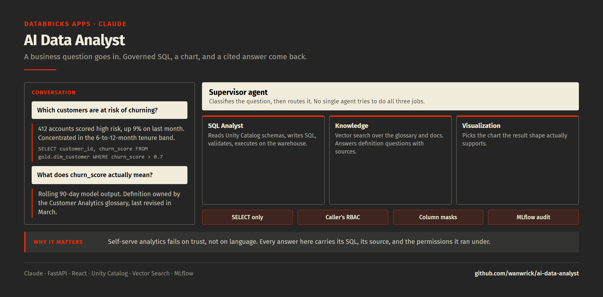

# 🤖 AI Data Analyst — Claude + Databricks Agent App

> A full-stack AI-powered data analyst application that lets users ask natural language questions about their data warehouse and get instant insights with visualizations. Built on Databricks Apps with Claude (Anthropic) as the reasoning engine.



---

## 🎯 What This Demonstrates

- **AI Agent Architecture**: Supervisor agent routing queries to specialized sub-agents
- **Natural Language → SQL**: Claude translates business questions into optimized SQL
- **RAG Knowledge Base**: Vector search over data documentation for context-aware answers
- **Interactive Visualizations**: Auto-generated charts based on query results
- **Databricks Apps Deployment**: Production-ready full-stack app on Databricks
- **MLflow Evaluation**: Quality monitoring with custom scorers for response accuracy

---

## 📐 Architecture

```
                        AI Data Analyst App

  +--------------+       +----------------------------------------+
  |   React UI   |------>|           FastAPI Backend              |
  |              |       |                                        |
  | - Chat input |       |  +----------------------------------+  |
  | - Charts     |       |  |   Supervisor Agent (Claude)      |  |
  | - Tables     |       |  |                                  |  |
  | - History    |       |  |  Routes to:                      |  |
  +--------------+       |  |  +-- SQL Analyst Agent           |  |
                         |  |  |   (SQL Gen + Warehouse)       |  |
                         |  |  +-- Knowledge Agent             |  |
                         |  |  |   (RAG + Vector Search)       |  |
                         |  |  +-- Viz Agent                   |  |
                         |  |      (Chart recommendations)     |  |
                         |  +----------------------------------+  |
                         |                                        |
                         |  +----------------------------------+  |
                         |  |     Databricks Integration       |  |
                         |  |  - SQL Warehouse (compute)       |  |
                         |  |  - Unity Catalog (governance)    |  |
                         |  |  - Vector Search (RAG)           |  |
                         |  |  - MLflow (evaluation)           |  |
                         |  +----------------------------------+  |
                         +----------------------------------------+
```

---

## 📁 Project Structure

```
ai-data-analyst/
├── backend/
│   ├── app.py                    # FastAPI entry point
│   ├── agents/
│   │   ├── supervisor.py         # Query routing agent
│   │   ├── sql_analyst.py        # Natural language → SQL
│   │   ├── knowledge_agent.py    # RAG over documentation
│   │   └── viz_agent.py          # Visualization recommendations
│   ├── services/
│   │   ├── databricks_client.py  # SDK wrapper
│   │   ├── vector_search.py      # Knowledge base search
│   │   └── sql_executor.py       # Safe SQL execution
│   ├── models/
│   │   └── schemas.py            # Pydantic models
│   └── requirements.txt
├── frontend/
│   ├── src/
│   │   ├── App.tsx               # Main React app
│   │   ├── components/
│   │   │   ├── ChatInterface.tsx  # Message input/display
│   │   │   ├── QueryResult.tsx    # Table + chart display
│   │   │   └── SchemaExplorer.tsx # Data catalog browser
│   │   └── api/
│   │       └── client.ts         # Auto-generated API client
│   ├── package.json
│   └── vite.config.ts
├── config/
│   ├── app.yaml                  # Databricks Apps config
│   └── .env.example              # Environment variables
├── docs/
│   └── demo.png
├── setup.sh                      # One-click setup
├── deploy.sh                     # Deploy to Databricks Apps
└── README.md
```

---

## 🚀 Quick Start

### Prerequisites
- Databricks workspace with SQL Warehouse
- Claude API key (Anthropic)
- Python 3.11+, Node.js 18+, Bun

### Setup

```bash
# 1. Clone and enter project
git clone https://github.com/wanwrick/ai-data-analyst.git
cd ai-data-analyst

# 2. Run interactive setup
./setup.sh
# Configures Databricks auth, installs deps, creates .env

# 3. Start development server
./watch.sh
# Backend: http://localhost:8000
# Frontend: http://localhost:3000

# 4. Deploy to Databricks Apps
./deploy.sh --create
```

---

## 💡 Example Queries

| User Question | Agent | Output |
|--------------|-------|--------|
| "What was our revenue last month?" | SQL Analyst | Revenue summary + trend chart |
| "Which customers are at risk of churning?" | SQL Analyst | Churn risk table + segmentation |
| "What does the RBAC transformation column mean?" | Knowledge | Documentation excerpt |
| "Show me a funnel from page views to purchases" | SQL + Viz | Funnel visualization |
| "Compare Q4 vs Q3 product performance" | SQL Analyst | Period comparison table |

---

## 🔧 Key Implementation Details

### Supervisor Agent (Claude)
The supervisor classifies incoming queries and routes to the best sub-agent:

```python
class SupervisorAgent:
    """Routes user queries to specialized sub-agents."""

    ROUTING_PROMPT = """You are a data analyst supervisor.
    Classify the user's question into one of:
    - SQL_QUERY: Questions answerable with data (metrics, trends, comparisons)
    - KNOWLEDGE: Questions about data definitions, business rules, documentation
    - VISUALIZATION: Requests to create or modify charts/dashboards
    Respond with only the classification."""

    async def route(self, question: str) -> AgentResponse:
        classification = await self.classify(question)
        if classification == "SQL_QUERY":
            return await self.sql_agent.analyze(question)
        elif classification == "KNOWLEDGE":
            return await self.knowledge_agent.search(question)
        else:
            return await self.viz_agent.recommend(question)
```

### SQL Analyst Agent
Translates natural language to SQL using Unity Catalog metadata:

```python
class SQLAnalystAgent:
    """Generates and executes SQL from natural language questions."""

    async def analyze(self, question: str) -> AnalysisResult:
        # 1. Fetch relevant table schemas from Unity Catalog
        context = await self.get_schema_context(question)

        # 2. Generate SQL with Claude
        sql = await self.generate_sql(question, context)

        # 3. Validate SQL (prevent dangerous operations)
        self.validate_sql(sql)

        # 4. Execute on SQL Warehouse
        results = await self.execute(sql)

        # 5. Generate natural language summary
        summary = await self.summarize(question, results)

        return AnalysisResult(sql=sql, data=results, summary=summary)
```

### Knowledge Agent (RAG)
Uses Databricks Vector Search for documentation Q&A:

```python
class KnowledgeAgent:
    """RAG agent over data documentation and business glossary."""

    async def search(self, question: str) -> KnowledgeResult:
        # 1. Embed question and search vector index
        docs = await self.vector_search.similarity_search(
            query=question,
            index_name="data_docs_index",
            num_results=5
        )

        # 2. Generate answer with retrieved context
        answer = await self.generate_answer(question, docs)

        return KnowledgeResult(answer=answer, sources=docs)
```

### MLflow Evaluation
Quality monitoring for every response:

```python
# Custom scorer for response accuracy
@mlflow.scorer
def sql_accuracy_scorer(inputs, outputs, expectations):
    """Evaluate if generated SQL returns correct results."""
    return {
        "sql_valid": outputs.sql_executes_successfully,
        "result_matches": outputs.result_matches_expectation,
        "response_time_ms": outputs.latency_ms
    }
```

---

## 🛡️ Safety & Governance

- **Read-only SQL**: Only SELECT statements allowed (no DDL/DML)
- **Unity Catalog RBAC**: Respects user's data access permissions
- **Query validation**: SQL injection prevention + cost guardrails
- **Audit logging**: All queries logged to MLflow for traceability
- **PII masking**: Leverages Unity Catalog column masks

---

## 🏷️ Technologies

`Databricks` `Claude (Anthropic)` `FastAPI` `React` `TypeScript` `MLflow` `Vector Search` `Unity Catalog` `SQL Warehouse` `Tailwind CSS` `Recharts`

---

## 👤 Author

**Paroz Mehta**

[](https://linkedin.com/in/paroz-mehta)

Built with [Claude-Databricks App Template](https://github.com/databricks-solutions/claude-databricks-app-template) and [Databricks AI Dev Kit](https://github.com/databricks-solutions/ai-dev-kit)
